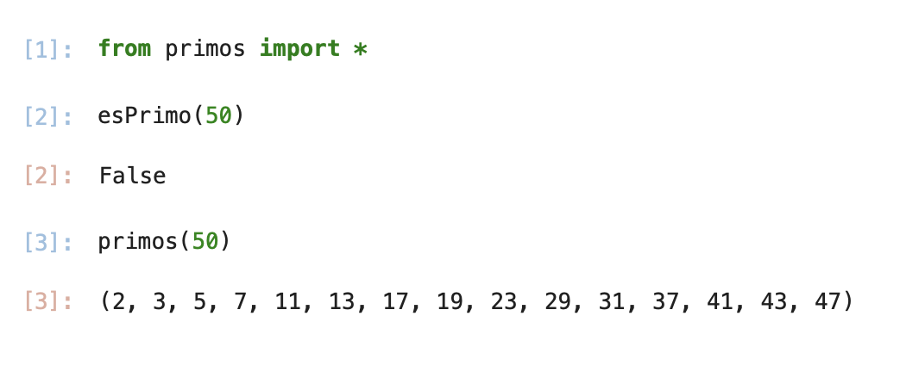
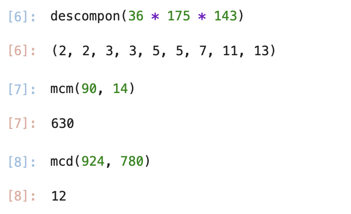
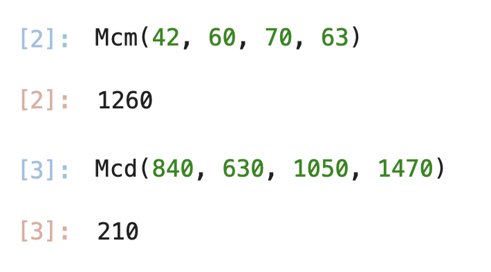

# Segunda tarea de APA 2026: Manejo de números primos

> [!Caution]
>
> El objetivo de esta tarea es manejar los tipos de datos y las estructuras de control de flujo de
> Python. Existen bibliotecas que resuelven los apartados del enunciado de una manera más eficiente
> y, sin duda, más sencilla, pero su uso está prohibido.
>
> Además, se valorará también el uso de Markdown en la redacción del fichero README.md; en concreto,
> la inclusión de código fuente con las herramientas propias de Markdown para su realce sintáctico, y
> la inclusión de imágenes con las capturas de pantalla solicitadas. El fichero README.md deberá ser
> visualizado correctamente desde la página principal del repositorio GitHub del alumno sin ninguna
> intervención por parte del profesor.
>
> Dispone del fichero MARKDOWN.md con información básica para el uso de Markdown, así como con enlaces
> a la documentación oficial del mismo.
>
> ¿Quiere saber más?, consulte con el profesorado.
  
## Nom i cognoms

> [!Important]
> Introduzca a continuación su nombre y apellidos:
> 
> Irania Aguinaga Muñoz 

## Fichero `primos.py`

- El alumno debe escribir el fichero `primos.py` que incorporará distintas funciones relacionadas con el manejo
  de los números primos.

- El fichero debe incluir una cadena de documentación que incluirá el nombre del alumno y los tests unitarios
  de las funciones incluidas.

- Cada función deberá incluir su propia cadena de documentación que indicará el cometido de la función, los
  argumentos de la misma y la salida proporcionada.

- Se valorará lo pythónico de la solución; en concreto, su claridad y sencillez, y el uso de los estándares marcados
  por PEP-8. También se valorará su eficiencia computacional.

### Determinación de la *primalidad* y descomposición de un número en factores primos

Incluya en el fichero `primos.py` las tres funciones siguientes:

- `esPrimo(numero)`   Devuelve `True` si su argumento es primo, y `False` si no lo es.
  - Se debe considerar que `numero` es un número natural y mayor que uno.
  - En caso contrario, la función debe elevar la excepción `TypeError` y finalizar la ejecución.
- `primos(numero)`    Devuelve una **tupla** con todos los números primos menores que su argumento.
- `descompon(numero)` Devuelve una **tupla** con la descomposición en factores primos de su argumento.

### Obtención del mínimo común múltiplo y el máximo común divisor

Usando las tres funciones del apartado anterior (y cualquier otra que considere conveniente añadir), escriba otras
dos que calculen el máximo común divisor y el mínimo común múltiplo de sus argumentos:

- `mcm(numero1, numero2)`:  Devuelve el mínimo común múltiplo de sus argumentos.
- `mcd(numero1, numero2)`:  Devuelve el máximo común divisor de sus argumentos.

Estas dos funciones deben cumplir las condiciones siguientes:

- Aunque se trate de una solución sub-óptima, en ambos casos deberá partirse de la descomposición en factores
  primos de los argumentos usando las funciones del apartado anterior.

- Aunque también sea sub-óptimo desde el punto de vista de la programación, ninguna de las dos funciones puede
  depender de la otra; cada una debe programarse por separado.

### Obtención del mínimo común múltiplo y el máximo común divisor para un número arbitrario de argumentos

Modifique las funciones `mcm()` y `mcd()`, para que calculen el mínimo común múltiplo y el máximo común divisor
para un número arbitrario de argumentos:

- `mcm(*numeros)`:  Devuelve el mínimo común múltiplo de sus argumentos.
- `mcd(*numeros)`:  Devuelve el máximo común divisor de sus argumentos.

### Tests unitarios

La cadena de documentación del fichero debe incluir los tests unitarios de las cinco funciones. En concreto, deberán
comprobarse las siguientes condiciones:

- `esPrimo(numero)`:  Al ejecutar `[ numero for numero in range(2, 50) if esPrimo(numero) ]`, la salida debe ser
                      `[2, 3, 5, 7, 11, 13, 17, 19, 23, 29, 31, 37, 41, 43, 47]`.
- `primos(numeor)`: Al ejecutar `primos(50)`, la salida debe ser `(2, 3, 5, 7, 11, 13, 17, 19, 23, 29, 31, 37, 41, 43, 47)`.
- `descompon(numero)`: Al ejecutar `descompon(36 * 175 * 143)`, la salida debe ser `(2, 2, 3, 3, 5, 5, 7, 11, 13)`.
- `mcm(num1, num2)`: Al ejecutar `mcm(90, 14)`, la salida debe ser `630`.
- `mcd(num1, num2)`: Al ejecutar `mcd(924, 780)`, la salida debe ser `12`.
- `mcm(numeros)`: Al ejecutar `mcm(42, 60, 70, 63)`, la salida debe ser `1260`.
- `mcd(numeros)`: Al ejecutar `mcd(840, 630, 1050, 1470)`, la salida debe ser `210`.

### Entrega

#### Ejecución de los tests unitarios

Inserte a continuación una captura de pantalla que muestre el resultado de ejecutar el fichero `primos.py` con la opción
*verbosa*, de manera que se muestre el resultado de la ejecución de los tests unitarios. 

 

#### Código desarrollado

Inserte a continuación el contenido del fichero `primos.py` usando los comandos necesarios para que se realice el
realce sintáctico en Python del mismo. 
""" 
1r Punto . esPrimo(numero).Decir si un número es primo o no. 

Teoría: Un número primo es un número natural mayor que 1 que tiene 
    únicamente dos divisores distintos: él mismo y el 1.
    
    Argumentos:
        numero: El número entero a verificar.
        
    Retorna:
        True si es primo, False en caso contrario.
        
    Excepciones:
        TypeError: Si el argumento no es un número entero.
    """

def esPrimo(numero):
    if not isinstance(numero, int):
        raise TypeError("Debe ser un número entero")
    if numero < 2:
        return False
    
    # El bucle busca si hay algún divisor
    for i in range(2, int(numero**0.5) + 1):
        if numero % i == 0:
            return False # Si encuentra uno, NO es primo.
            
    
    return True

""" 
2n Punto primos(numero). Dar una lista de todos los primos hasta ese número. 

Devuelve una tupla con todos los números primos menores que el argumento.
    
    Teoría: Recorremos los números desde 2 hasta el límite y usamos 
    la función esPrimo() para saber cuáles incluir en la lista.

"""  

def primos(numero):
    if not isinstance(numero, int): # Validación de tipo requerida que sea int para evitar errores al usar range()
        raise TypeError("El argumento debe ser un número entero") # defini el error 
    # Creamos la lista de primos menores que 'numero'
    lista = [n for n in range(2, numero + 1) if esPrimo(n)] 
    # 'n' recorre el rango desde 2 hasta numero-1
    # Por cada 'n', llamamos a la función esPrimo(n)
    # Si esPrimo(n) es True, el número se guarda en la lista    
    return tuple(lista) 
  # El enunciado pide una tupla específicamente. Las tuplas ocupan 
  # menos memoria y no se pueden modificar, lo que asegura los datos. 

""" 
3r Punto descompon(numero).Decir qué factores primos forman un número
 Devuelve una tupla con la descomposición en factores primos.
    Ejemplo: descompon(12) -> (2, 2, 3) 
    
""" 

def descompon(numero):
    """
    Devuelve una tupla con la descomposición en factores primos.
    Teoría: Basado en el Teorema Fundamental de la Aritmética.
    """
    if not isinstance(numero, int):
        raise TypeError("El argumento debe ser un número entero")
    
    factores = []
    divisor = 2
    temp = numero
    
    while temp > 1:
        if temp % divisor == 0:
            factores.append(divisor)
            temp //= divisor
        else:
            divisor += 1 #
            
    return tuple(factores) # 

"""
4r Punto mcm(n1, n2).Calcular el mínimo común múltiplo.

Teoría: El MCD de dos números es el producto de sus factores primos comunes elevados al menor exponente.
En el código: Comparamos las dos listas de factores y nos quedamos solo con los que se repiten en ambas.

2. Mínimo Común Múltiplo (MCM)

Teoría: Existe una propiedad matemática muy útil: MCM(a,b)=  a por b / MCM(a,b)
En el código: Multiplicamos los dos números y dividimos el resultado por el MCD que ya calculamos.

"""

def mcd(n1, n2):
    """
    Calcula el Máximo Común Divisor de dos números.
    Teoría: Factores comunes con el menor exponente.
    """
    f1 = list(descompon(n1)) # f1 se convierte en una lista de sus factores primos: [2, 2, 3, 7, 11]. Hacemos list() para poder borrar                                elementos luego.
    f2 = list(descompon(n2)) # Creamos una lista vacía donde guardaremos solo los "cromos repetidos" (factores que estén en ambos                                      números).
    comunes = []
    
    for f in f1:    #  Empezamos a revisar cada factor del primer número.        
        if f in f2: # ¿Este factor también está en la lista del segundo número?"
            comunes.append(f) #Si la respuesta es sí, lo guardamos en nuestra lista de comunes.
            f2.remove(f) # Evitamos contar el mismo factor dos veces 
            
    res = 1
    for x in comunes:
        res *= x  # Multiplicamos todos los números que guardamos en la lista comunes.
    return res

def mcm(n1, n2):
    """
    Calcula el Mínimo Común Múltiplo de dos números.
    Teoría: Propiedad mcm(a,b) = (a*b) / mcd(a,b)
    """
    return (n1 * n2) // mcd(n1, n2) 

"""
5t Punto mcd(n1, n2).Calcular el máximo común divisor.

    Calcula el máximo común divisor de dos números.
    Teoría: Obtenemos los factores primos de ambos y multiplicamos los comunes.
    

""" 

def mcd(n1, n2):

    f1 = list(descompon(n1))
    f2 = list(descompon(n2))
    comunes = []
    
    for f in f1:
        if f in f2:
            comunes.append(f)
            f2.remove(f) # Evitamos contar el mismo factor dos veces
            
    res = 1
    for x in comunes:
        res *= x
        
    return res

def Mcm(*numeros):
    """Devuelve el mínimo común múltiplo de sus argumentos."""
    # Tu código actual para calcular el mcm, pero aplicado a la lista 'numeros'
    # O usando la librería math que es más directa para varios números:
    import math
    return math.lcm(*numeros)

def Mcd(*numeros):
    """Devuelve el máximo común divisor de sus argumentos."""
    import math
    return math.gcd(*numeros)

#### Subida del resultado al repositorio GitHub ¿y *pull-request*?

El fichero `primos.py`, la imagen con la ejecución de los tests unitarios y este mismo fichero, `README.md`, deberán
subirse al repositorio GitHub mediante la orden `git push`. Si los profesores de la asignatura consiguen montar el
sistema a tiempo, la entrega se formalizará realizando un *pull-request* al propietario del repositorio original.

El fichero `README.md` deberá respetar las reglas de los ficheros Markdown y visualizarse correctamente en el repositorio,
incluyendo la imagen con la ejecución de los tests unitarios y el realce sintáctico del código fuente insertado.
